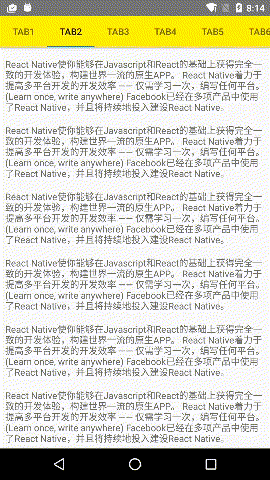

# mao-rn-android-kit

用React Native 中使用的一些Android原生模块/组件



---- 

包含

- CoordinatorLayout
- AppBarLayout
- TabLayout
- NestedScrollView

-----

## 安装

#### 第一步、执行 ```npm install mao-rn-android-kit --save``` 安装 该npm包

#### 第二步、配置你项目中的 ```android/settings.gradle``` 文件
```
include ..., ':mao-rn-android-kit'
project(':mao-rn-android-kit').projectDir = new File(settingsDir, '../node_modules/mao-rn-android-kit/android/kits')
```

#### 第三步、配置你项目中的 ```android/app/build.gradle``` 文件
```
...
dependencies {
    ...
    compile project(':mao-rn-android-kit') // <-- 加入这条
}
```

#### 第四步、在你项目的 android 源码中注册该模块

最新版的目标文件地址是 ```android/app/src/main/your.domain/MainApplication.java```

v27版本的目标文件地址是 ```android/app/src/main/your.domain/MainActive.java```

```
...

import com.maornandroidkit.kits.KitPackage; // <-- 导入模块

...

    @Override
    protected List<ReactPackage> getPackages() {
        return Arrays.<ReactPackage>asList(
            ...
            new KitPackage() // <--- 将 LibsPackage 实例 添加在这
        );
    }
...

```

#### 第五步、在项目中使用

```
import {
    CoordinatorLayoutAndroid,
    AppBarLayoutAndroid,
    TabLayoutAndroid,
    NestedScrollViewAndroid,
} from 'mao-rn-android-kit';


// 详细请看 源码中的 index.android.js 使用例子

```

------

## API

### CoordinatorLayoutAndroid

属性
```
layoutParams: {
    width: number | "match_parent" | "wrap_content"
    height: number | "match_parent" | "wrap_content"
}

fitsSystemWindows: boolean;
```

方法
```
//设置目标元素 app:layout_behavior 为  AppBarLayout.ScrollingViewBehavior
setScrollingViewBehavior(view: Component);
```

----

### AppBarLayoutAndroid

常量
```
// 以下常量配合 scrollFlag属性用
AppBarLayoutAndroid.SCROLL_FLAG_ENTRY_ALWAYS
AppBarLayoutAndroid.SCROLL_FLAG_ENTRY_ALWAYS_COLLAPSED
AppBarLayoutAndroid.SCROLL_FLAG_EXIT_UNTIL_COLLAPSED
AppBarLayoutAndroid.SCROLL_FLAG_SCROLL
AppBarLayoutAndroid.SCROLL_FLAG_SNAP

```

属性
```
layoutParams: {
    width: number | "match_parent" | "wrap_content"
    height: number | "match_parent" | "wrap_content"
    scrollFlag: number
}

fitsSystemWindows: boolean;
```

----

### TabLayoutAndroid

属性
```
//选项卡项目
tabs: { text: string }[];

//选项卡项目默认字体颜色 
tabTextColor: string;

//选项卡项目选中字体颜色 
tabSelectedTextColor: string;

//选项卡下标线颜色 
tabIndicatorColor: string;

//选项卡下标线高度
tabIndicatorHeight: number;

//选项卡项目布局模式
tabMode: "scrollale" | "fixed";

//选卡布局位置
tabGravity: "center" | "fill";

```

方法
```
//绑定 viewPager
setViewPager(viewPager: ViewPagerAndroid, tabs?: {text: string}[]);
```

----

### NestedScrollViewAndroid

属性, 继承 ScrollView 的属性
```
...

//显示水平轴滚动标记
showVerticalScrollIndicator: boolean;
```

方法, 继承 ScrollView的方法
```

```

----

参考过:

- [react-native-android-design-support](https://github.com/Neson/react-native-android-design-support)